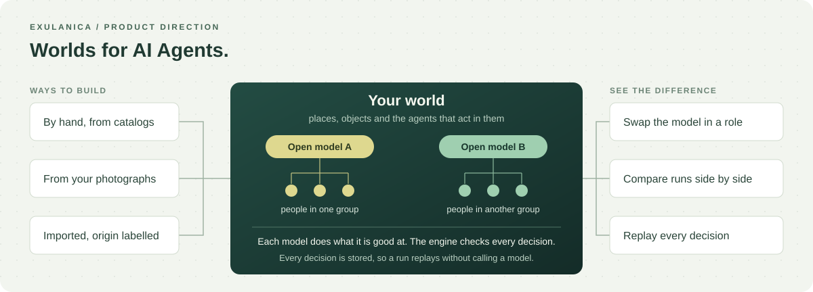

<p align="center">
  
</p>

<h1 align="center">Exulanica</h1>

<p align="center"><strong>Exulanica: Worlds for AI Agents.</strong></p>

<p align="center">
  <a href="https://exulanica.com">Website</a> ·
  <a href="docs/README.md">Documentation</a> ·
  <a href="docs/product-direction.md">Roadmap</a> ·
  <a href="#getting-started">Getting started</a>
</p>

<p align="center">
  <a href="https://github.com/twinkling-reality/exulanica/actions/workflows/check.yml"></a>
  <a href="LICENSE"></a>
  <a href="pyproject.toml"></a>
  <a href="web/package.json"></a>
</p>

There are about 3 million open AI models, and 85.6% of them have been downloaded fewer than 200
times. Most never get seen, let alone used.

Exulanica gives them a place to work. Create your own world, exactly how you want it, and power it
with open models, each doing what it's good at, all in one place you control. You get hands-on
exposure to models you'd never have tried. Model makers get their work used.

Built on NVIDIA Nemotron and Nebius Token Factory's open models.

<sub>Figures: Hugging Face, ["State of Open Models: Summer 2026"](https://huggingface.co/blog/state-of-open-models-summer-2026), published 2026-08-14 (about 2.96
million public model repositories; roughly 85.6% of models with fewer than 200 lifetime
downloads).</sub>

<p align="center">
  
  <br><sub>Product direction. The capability boundaries below distinguish implemented foundations from delivery targets.</sub>
</p>

## Models inside the world

A person builds a world, and open models run what happens inside it. The things in a world that
act are its agents: the people in your world, animals, vehicles and decision-makers such as a
shopkeeper. Each model does what it is good at, in its own role, and the person can swap the model
behind a role and see the difference. World models generate how a world looks; Exulanica is the
world AI models live in.

A model is a proposer, not an authority. Each role declares what the model observes and which
actions it may take; the engine validates every proposed action before it takes effect, and every
accepted decision is stored, so a run replays without calling a model and two runs from the same
saved world compare fairly. Every hosted model call passes one policy boundary that enforces the
egress allowlist, the budget and the person's rights.

Built: several open models serve hosted roles through that boundary (the
[model manifest](exulanica/models/models.manifest.json)); the people in a world follow a
deterministic planner, and a society engine version accepts validated, stored model decisions for
them ([society contract](docs/synthetic-society-contract.md#explicit-model-proposals-and-exact-replay));
paired runs compare one intervention against its control
([society experiments](docs/society-experiments.md)). Not built: choosing a model for a person or a
group, mixed-model runs shown in the application, measured results per model and a retraining
loop. The [first milestone](docs/product-direction.md#first-milestone) is two open models running
one town, shown side by side.

## The world

The [product roadmap](docs/product-direction.md) defines six connected parts of the experience:

<table>
  <tr>
    <td width="50%" valign="top">
      <h3>Models run your world</h3>
      Open models decide what the agents in your world do, each in its own role. The engine validates every decision and stores it, so a run replays exactly. The society's people accept validated model decisions; choosing a model per person or group is the first milestone.
      <p><a href="docs/capabilities/simulation.md">Simulation</a> · <a href="docs/model-and-service-selection.md">Model selection</a></p>
    </td>
    <td width="50%" valign="top">
      <h3>Swap a model, see the difference</h3>
      Run the same saved world twice and compare what happened. Paired society runs compare one intervention against its control; comparing two models side by side in the application is the first milestone.
      <p><a href="docs/society-experiments.md">Controlled comparisons</a> · <a href="docs/product-direction.md#first-milestone">First milestone</a></p>
    </td>
  </tr>
  <tr>
    <td valign="top">
      <h3>Build your world</h3>
      Place pieces from the catalogs by hand, make a world from photographs of a real place, or import content with its origin labelled. A town, a familiar place or a fantasy city are equally valid, and your edits persist as versions.
      <p><a href="docs/capabilities/world-creation.md">World creation</a> · <a href="docs/capabilities/scene-reconstruction.md">Reconstruction</a></p>
    </td>
    <td valign="top">
      <h3>Give the world life</h3>
      The people in your world follow routines, walk to the places they use and respond to what you change. Physical or fictional rules define how the world and its time behave.
      <p><a href="docs/synthetic-society-contract.md">Society contract</a> · <a href="docs/product-direction.md#configurable-world-rules">World rules</a></p>
    </td>
  </tr>
  <tr>
    <td valign="top">
      <h3>Inspect the data</h3>
      Inspect a subject's geometry, properties, relationships and origin, and what an agent decided. Query, edit and extract supported world content as reusable data while keeping its identity across views.
      <p><a href="docs/atlas-reconstruction-inspection.md">Representation and inspection</a> · <a href="docs/capabilities/world-api.md">World API</a></p>
    </td>
    <td valign="top">
      <h3>The Companion and your photographs</h3>
      Features for building and understanding a world: the Companion is an AI partner that helps you explore, create and understand what happens, and your own photographs can become places and references in a world, under your rights and consent.
      <p><a href="docs/capabilities/companion.md">Companion</a> · <a href="docs/saved-world-entry.md#reference-photographs">Reference photographs</a></p>
    </td>
  </tr>
</table>

## The world as data

The architectural goal is **structured, addressable world state**: meaningful subjects and changes
have identities, properties, relationships, spatial context and history that people and programs
can inspect and act on. Supported geometry and records can be selected, queried and reused through
declared interfaces, with their origin and permissions preserved.

Meshes, tessellated surfaces, point clouds and Gaussian splats are representations of that state.
They do not by themselves provide semantic labels, complete object extraction or physical behavior.
A render vertex need not be a permanent database entity; a selectable object or consequential
change needs a stable record. This foundation lets different renderers, models and applications
work with the same world. See the [world state architecture](docs/world-memory-model.md).

## Capability boundaries

The repository supplies working components for this experience. Their contracts define the
supported operations; the full product direction is broader than those components.

| Area | Implemented foundation | Delivery target |
| --- | --- | --- |
| Models in the world | Open models in hosted roles through one policy boundary; validated, stored model decisions for the society's people | A model chosen per person or group, mixed-model runs shown side by side, measured results per model and a retraining loop |
| Persistent worlds | Authored starter worlds, saved versions, object edits and undo, appearance state, reference photographs | A complete personal-media-to-editable-world journey |
| Inspectable data | Supported point and surface representations, subject selection, structured records and source references | Complete reusable object extraction and consistent semantic coverage across sources |
| Companion | Conversation, selection context and reviewed appearance proposals | Shared activity, durable personal continuity and broader creation tools |
| Life and experiments | Deterministic societies, bounded motion, recorded paired comparisons with specific interventions | Richer social behavior, customizable world rules and validated model-driven scenarios |
| Developer access | Authenticated world APIs, an independent Python client and signed partial world packages | General model adapters, dataset workflows and runnable interchange |

General model adapters, user-defined world rules and dataset generation are delivery targets.
The [experiment contract](docs/society-experiments.md) specifies one bounded application of the world:
paired society runs with supported interventions.
Synthetic outcomes do not establish predictions about real people or real-world systems.

## Architecture

A persistent world connects identity, spatial state, time, edits and recorded events. The browser,
Companion, model adapters and external clients work through declared interfaces. Observations,
authored content and simulation results retain distinct origins and meanings.

| Module | Responsibility | Reference |
| --- | --- | --- |
| World state | Versions, sources, identities and edit history | [World state architecture](docs/world-memory-model.md) |
| Creation and representation | Reconstruction, authored objects, appearance and browser rendering | [World composition](docs/world-composition-contract.md) |
| Simulation | Supported behaviors, inhabitants and replayable outcomes | [Society contract](docs/synthetic-society-contract.md) |
| Model integration | Replaceable reconstruction, generation and decision providers, with validated outputs | [Model selection](docs/product-direction.md#model-selection-and-compute-priorities) |
| API and portability | Authorized reads and edits; signed, capability-declared snapshots | [Developer client](docs/capabilities/developer-client.md) · [World package](docs/world-memory-package.md) |

Python and PostgreSQL carry the backend; TypeScript and PlayCanvas carry the browser experience.
The configured Companion answer path uses **NVIDIA Nemotron through Nebius Token Factory** to
compose answers from validated evidence. Other model roles support perception, retrieval and
reviewed proposals. The [model and service selection](docs/model-and-service-selection.md) describes
the implemented callers, evaluation evidence and hosting boundaries. This does not imply that the
whole application or its background workers are deployed on Nebius Serverless.

A world is structured, versioned state that models act in, not a single trained general-purpose
predictor. The portable format is named **World Memory Package** in its technical
contract; verifying a package does not by itself load a runnable world in another application.

## Getting started

### Browser preview

Requires Git, Node.js 22 or newer, and pnpm 10.7.1.

```bash
git clone https://github.com/twinkling-reality/exulanica.git
cd exulanica/web
pnpm install --frozen-lockfile
pnpm app
```

Open [http://localhost:5173/?preview=1](http://localhost:5173/?preview=1), or the address Vite
prints if that port is occupied, with `?preview=1` appended. This development preview uses fixture
data. It does not create an authenticated saved world or demonstrate media reconstruction.

### Persistent application

The authenticated application uses a separate API, PostgreSQL, local asset storage and configured
accounts. Backend development requires Python 3.11 and [uv](https://docs.astral.sh/uv/);
reconstruction and processing use additional dependencies and workers.

Follow [development setup](docs/development-setup.md) for installation and services,
[account configuration](docs/deployment.md) for deployment requirements, and
[the Python client guide](docs/capabilities/developer-client.md) to build against a configured API.

## Documentation

| Start here | Go deeper |
| --- | --- |
| [Product direction and delivery gates](docs/product-direction.md) | [World composition](docs/world-composition-contract.md) |
| [Saved worlds](docs/saved-world-entry.md) | [Authored objects and behaviors](docs/world-objects-contract.md) |
| [World API](docs/capabilities/world-api.md) | [Independent Python client](docs/capabilities/developer-client.md) |
| [Society experiments](docs/society-experiments.md) | [Simulation tooling and adoption gates](docs/product-direction.md#modular-simulation-and-scientific-tooling) |
| [Documentation hub](docs/README.md) | [Complete document catalog](docs/all-documents.md) |

For bugs and focused proposals, [open an issue](https://github.com/twinkling-reality/exulanica/issues)
with the relevant world operation, expected result and reproduction steps. Use the capability
contracts and [development guide](docs/development-setup.md) when contributing a change.

## License

[Apache-2.0](LICENSE). Model weights, datasets and third-party assets have their own terms;
see [third-party notices](THIRD_PARTY_NOTICES.md).
