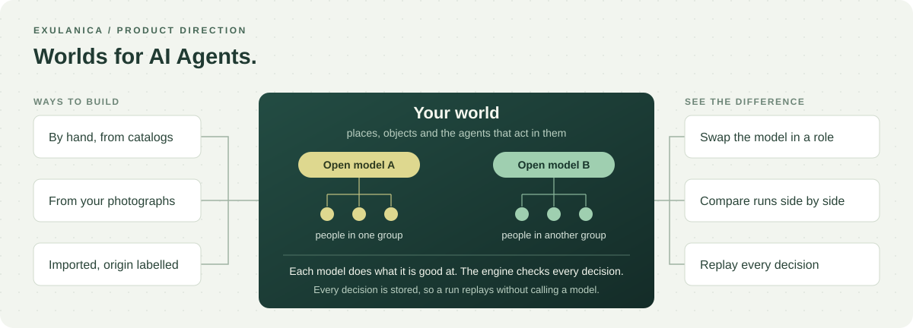

<p align="center">
  
</p>

<h1 align="center">Exulanica</h1>

<p align="center"><strong>Exulanica: Worlds for AI Agents.</strong></p>

<p align="center">
  <a href="https://exulanica.com">Website</a> ·
  <a href="docs/README.md">Documentation</a> ·
  <a href="docs/product-direction.md">Roadmap</a> ·
  <a href="#getting-started">Getting started</a>
</p>

<p align="center">
  <a href="https://github.com/twinkling-reality/exulanica/actions/workflows/check.yml"></a>
  <a href="LICENSE"></a>
  <a href="pyproject.toml"></a>
  <a href="web/package.json"></a>
</p>

There are about 3 million open AI models, and 85.6% of them have been downloaded fewer than 200
times. Most never get seen, let alone used.

Exulanica gives them a place to work. Create your own world, exactly how you want it, and power it
with open models, each doing what it's good at, all in one place you control. You get hands-on
exposure to models you'd never have tried. Model makers get their work used.

Built on NVIDIA Nemotron and Nebius Token Factory's open models.

<sub>Figures: Hugging Face, ["State of Open Models: Summer 2026"](https://huggingface.co/blog/state-of-open-models-summer-2026), published 2026-08-14 (about 2.96
million public model repositories; roughly 85.6% of models with fewer than 200 lifetime
downloads).</sub>

<p align="center">
  
  <br><sub>Product direction. The capability boundaries below distinguish implemented foundations from delivery targets.</sub>
</p>

## For hackathon judges

The demonstration world is the scene "Three strangers": a knight, a lantern spirit and a gate that
characters from games come through, each being's mind an open model on Nebius Token Factory. The scene
is data ([three-strangers.v5.json](assets/catalogs/scenes/three-strangers.v5.json)), and
`scripts/demo/build_scene.py` lays it into a saved world through the product's own routes;
[Getting started](#getting-started) runs it. What each part shows, and where it is checked:

| What you see | Checked by |
| --- | --- |
| A town made from one sentence, checked before it is made | [World creation](docs/capabilities/world-creation.md) |
| Things placed, and beings asked to act, by saying so to the Companion and confirming once | `tests/test_companion_things_plan.py`, `tests/test_companion_things_postgres.py`, `tests/test_companion_hands_plan.py`, `tests/test_companion_hands_postgres.py` |
| Each being's mind is an open model on Nebius Token Factory, two of the scene's three NVIDIA Nemotron | the scene's `minds` and `travellers` in [three-strangers.v5.json](assets/catalogs/scenes/three-strangers.v5.json); which models can be a being's mind: [the probe verdicts](docs/evaluation/2026-10-08-society-mind-probe-verdicts.json) |
| Beings talk, pick things up and hand them over, and a replay regenerates the history without asking a model | `tests/test_society_hands_postgres.py` (a knight walks to a sword, picks it up and gives it to another knight), `tests/test_society_hands.py` |
| A world made before a new ability keeps replaying as it ran | `tests/test_society_things_before_modules.py`, `tests/test_society_versions_survive_upgrades.py` |
| Click a being: what it is, what it does here, what it holds, its mind, its look's licence and source | `tests/test_thing_card_postgres.py` (`test_a_thing_s_card_says_what_it_is_does_here_and_wears`) |
| Drawing the knight in another look changes nothing it does | `tests/test_thing_card_postgres.py` (`test_choosing_a_look_changes_only_the_look`), and the card's own "How we know" line |
| A player's character crosses in from Luanti through the gate, lives in the world with an open model as its mind, and goes home with what it holds | `bridges/luanti/run/check.py` (the check a crossing runs against a world), `tests/test_door_postgres.py` |
| An outside AI agent takes its turns over MCP and is shown what the world's own minds are shown | [bridges/agents](bridges/agents/README.md) |
| Every import and crossing says what came across and what did not | [translation manifests](docs/things-contract.md#translation-manifests), for example [the KayKit knight's](assets/catalogs/things/manifests/kaykit-knight.v1.json) |
| Every being a model runs, and every line a model says, is marked AI | `web/packages/app/test/thing-marks.test.ts`, `web/packages/app/test/thing-lines.test.ts` |
| A creature drafted from words; its sculpted look is made on Nebius AI Cloud and offered only where it passed every check (4 of 8 creatures in the second trial) | [the first rig trial](docs/evaluation/2026-10-07-creature-rig-trial.json), [the second](docs/evaluation/2026-10-07-creature-rig-trial-2.json) |
| 3D pieces generated on Nebius AI Cloud GPUs as Serverless AI jobs, each with a receipt (52 pieces from 15 jobs, 43 within every check) | [the trial record](docs/evaluation/2026-10-07-nebius-generated-assets-trial.json) |

**Built on:** Nebius Token Factory for every model call (the beings' minds, the world, kind and creature
drafters, the Companion, reading pictures), with NVIDIA Nemotron 3 Super, Nano and Ultra and Nemotron
3.5 Lightning in the roles the [model manifest](exulanica/models/models.manifest.json) names; NVIDIA
NeMo Agent Toolkit for the outside agent example; Nebius AI Cloud Serverless AI jobs for 3D generation;
Tavily for reference lookups (`exulanica/references/adapters/tavily.py`). One policy boundary holds every
model call to its budget and allowlist and writes its receipt.

**Credits:** KayKit Adventurers 2.0 and KayKit Character Animations 1.1 by Kay Lousberg (CC0,
[assets/things/kaykit-adventurers-2](assets/things/kaykit-adventurers-2)). A Luanti player's own look is
built at a deployment from the operator's copy of Minetest Game's default player picture
(character.png by Jordach, CC BY-SA 3.0) and is never committed.

**What the records show, including what they got wrong:**
[Corrections and negative results in the evaluation records](docs/evaluation-corrections.md).

## Models inside the world

A person builds a world, and open models run what happens inside it. The things in a world that
act are its agents: the people in your world, animals, vehicles and decision-makers such as a
shopkeeper. Each model does what it is good at, in its own role, and the person can swap the model
behind a role and see the difference. World models generate how a world looks; Exulanica is the
world AI models live in.

A model is a proposer, not an authority. A person in a world is the one role a model decides for:
its decision contract declares what the model is shown and which actions it may choose, the engine
validates every choice before it takes effect, and every accepted decision is stored, so a run
replays without calling a model and two runs from the same saved world compare fairly. Traffic,
animals and shopkeepers are not model roles. Every hosted model call passes one policy boundary
that enforces the egress allowlist, the budget and the person's rights.

Built: several open models serve hosted roles through that boundary (the
[model manifest](exulanica/models/models.manifest.json)). The people in a saved world, whether it
started from the empty starter or was made from photographs, follow a deterministic planner, and
the world's owner can choose an open model to decide for one person or a group; each choice is
validated, stored and replayed without calling the model again
([people and models in a world](docs/capabilities/simulation.md)). A comparison runs the same
simulated hour once per model for one group of people, scores how they fared against a control
run, and the application shows the runs side by side; the world's owner starts one from the
application's Compare view, within a spending bound they state, on a server that holds development
seeds, and judged comparisons are recorded
([comparisons of models](docs/society-experiments.md#comparisons-of-models)). Not built: model
roles other than a person, traffic, weather or an economy run by models, and a retraining loop. The
[first milestone](docs/product-direction.md#first-milestone) is two open models running one town,
shown side by side; the implementation runs one simulated hour of a small square's eight people.

## The world

The experience has six connected parts; [product direction](docs/product-direction.md) sets the
order they are delivered in:

<table>
  <tr>
    <td width="50%" valign="top">
      <h3>Models run your world</h3>
      Open models decide what the people in your world do: where to go, whether to wait, stand a while or stop to talk. The engine validates every decision and stores it, so a run replays exactly. The world's owner chooses the model for each person or group of people; with no choice, their routine decides.
      <p><a href="docs/capabilities/simulation.md">People and models</a> · <a href="docs/decision-roles-contract.md">Decision roles</a> · <a href="docs/model-and-service-selection.md">Model selection</a></p>
    </td>
    <td width="50%" valign="top">
      <h3>Swap a model, see the difference</h3>
      Run the same saved world's hour under two models and compare what happened. A comparison scores how the people fared against a control run and shows both runs side by side in the application, where the world's owner starts it within a spending bound they state and watches its runs finish.
      <p><a href="docs/society-experiments.md">Controlled comparisons</a> · <a href="docs/product-direction.md#first-milestone">First milestone</a></p>
    </td>
  </tr>
  <tr>
    <td valign="top">
      <h3>Build your world</h3>
      Place pieces from the catalogs by hand, make a world from photographs of a real place, or import content with its origin labelled, and your edits persist as versions. A world started from the empty starter and a world made from photographs each host eight people on their ground, and the world's owner chooses the model that decides for them.
      <p><a href="docs/capabilities/world-creation.md">World creation</a> · <a href="docs/capabilities/scene-reconstruction.md">Reconstruction</a></p>
    </td>
    <td valign="top">
      <h3>Give the world life</h3>
      The people in your world follow routines, walk to the places they use and respond to what you change. Small birds fly and perch on the trees that host them, on a clock everyone watching shares. How the world and its time behave is its engine's; a person does not configure those rules.
      <p><a href="docs/synthetic-society-contract.md">Society contract</a> · <a href="docs/movement-modules-contract.md">Movement modules</a> · <a href="docs/product-direction.md#configurable-world-rules">World rules</a></p>
    </td>
  </tr>
  <tr>
    <td valign="top">
      <h3>Inspect the data</h3>
      Inspect a subject's geometry, properties, relationships and origin, and what an agent decided. Query, edit and extract supported world content as reusable data while keeping its identity across views.
      <p><a href="docs/atlas-reconstruction-inspection.md">Representation and inspection</a> · <a href="docs/capabilities/world-api.md">World API</a></p>
    </td>
    <td valign="top">
      <h3>The Companion and your photographs</h3>
      Features for building and understanding a world: the Companion is an AI partner that helps you explore, create and understand what happens, and your own photographs can become places and references in a world, under your rights and consent.
      <p><a href="docs/capabilities/companion.md">Companion</a> · <a href="docs/saved-world-entry.md#reference-photographs">Reference photographs</a></p>
    </td>
  </tr>
</table>

## The world as data

The architectural goal is **structured, addressable world state**: meaningful subjects and changes
have identities, properties, relationships, spatial context and history that people and programs
can inspect and act on. Supported geometry and records can be selected, queried and reused through
declared interfaces, with their origin and permissions preserved.

Meshes, tessellated surfaces, point clouds and Gaussian splats are representations of that state.
They do not by themselves provide semantic labels, complete object extraction or physical behavior.
A render vertex need not be a permanent database entity; a selectable object or consequential
change needs a stable record. This foundation lets different renderers, models and applications
work with the same world. See the [world state architecture](docs/world-memory-model.md).

## Capability boundaries

The repository supplies working components for this experience. Their contracts define the
supported operations; the full product direction is broader than those components.

| Area | Implemented foundation | Delivery target |
| --- | --- | --- |
| Models in the world | Open models in hosted roles through one policy boundary; a model chosen per person or group of a saved world's people, validated, stored and replayed; comparisons of models started from the application within a stated bound, scored against a control and shown side by side | Model roles other than a person, and a retraining loop |
| Persistent worlds | Authored starter worlds, worlds made from reviewed photographs, saved versions, object edits and undo, appearance state, reference photographs | A complete personal-media-to-editable-world journey |
| Inspectable data | Supported point and surface representations, subject selection, structured records and source references | Complete reusable object extraction and consistent semantic coverage across sources |
| Companion | Grounded answers, including about a world's simulated people; conversation memory kept across reloads; reviewed appearance proposals | Shared activity, durable personal continuity and broader creation tools |
| Life and experiments | Societies of eight people on a saved world's ground, with routines as data (rest, visit, stand, talk); small birds on a shared clock; recorded paired experiments with specific interventions | Richer social behavior, traffic in a world, customizable world rules and validated model-driven scenarios |
| Developer access | Authenticated world APIs, an independent Python client and signed partial world packages | General model adapters, dataset workflows and runnable interchange |

General model adapters, user-defined world rules and dataset generation are delivery targets.
The [experiment contract](docs/society-experiments.md) specifies one bounded application of the world:
paired society runs with supported interventions.
Synthetic outcomes do not establish predictions about real people or real-world systems.

## Architecture

A persistent world connects identity, spatial state, time, edits and recorded events. The browser,
Companion, model adapters and external clients work through declared interfaces. Observations,
authored content and simulation results retain distinct origins and meanings.

| Module | Responsibility | Reference |
| --- | --- | --- |
| World state | Identity, epistemic planes and representations; versions and edit history | [World state architecture](docs/world-memory-model.md) · [World objects](docs/world-objects-contract.md) |
| Creation and representation | Reconstruction, authored objects, appearance and browser rendering | [World composition](docs/world-composition-contract.md) |
| Simulation | Societies, the engines and routines that run them, movement modules and replayable outcomes | [Society contract](docs/synthetic-society-contract.md) · [Movement modules](docs/movement-modules-contract.md) |
| Models deciding | Decision roles as data, one validated decision path, comparisons of models | [Decision roles](docs/decision-roles-contract.md) · [Comparisons](docs/society-experiments.md#comparisons-of-models) |
| Model integration | Replaceable reconstruction, generation and decision providers behind one policy boundary, with validated outputs | [Model selection](docs/model-and-service-selection.md) · [Model manifest](exulanica/models/models.manifest.json) |
| API and portability | Authorized reads and edits; signed, capability-declared snapshots | [Developer client](docs/capabilities/developer-client.md) · [World package](docs/world-memory-package.md) |

Python and PostgreSQL carry the backend; TypeScript and PlayCanvas carry the browser experience.
The configured Companion answer path uses **NVIDIA Nemotron through Nebius Token Factory** to
compose answers from validated evidence. The open models a world's owner can choose for a person
are those the manifest records as verified to answer a choice. Other model roles support
perception, retrieval and reviewed proposals. The [model and service selection](docs/model-and-service-selection.md) describes
the implemented callers, evaluation evidence and hosting boundaries. This does not imply that the
whole application or its background workers are deployed on Nebius Serverless.

A world is structured, versioned state that models act in, not a single trained general-purpose
predictor. The portable format is named **World Memory Package** in its technical
contract; verifying a package does not by itself load a runnable world in another application.

## Getting started

### Browser preview

Requires Git, Node.js 22 or newer, and pnpm 10.7.1.

```bash
git clone https://github.com/twinkling-reality/exulanica.git
cd exulanica/web
pnpm install --frozen-lockfile
pnpm app
```

Open [http://localhost:5173/?preview=1](http://localhost:5173/?preview=1), or the address Vite
prints if that port is occupied, with `?preview=1` appended. This development preview uses fixture
data. It does not create an authenticated saved world or demonstrate media reconstruction, and
choosing or comparing the models that decide for a world's people needs the persistent application.

### Persistent application

The authenticated application uses a separate API, PostgreSQL, local asset storage and configured
accounts. Backend development requires Python 3.11 and [uv](https://docs.astral.sh/uv/);
reconstruction and processing use additional dependencies and workers.

Follow [development setup](docs/development-setup.md) for installation and services, and its
[people and models section](docs/development-setup.md#seeing-people-and-models-locally) to see
models decide in a local world; [account configuration](docs/deployment.md) for deployment
requirements; and [the Python client guide](docs/capabilities/developer-client.md) to build against
a configured API.

## Documentation

| Start here | Go deeper |
| --- | --- |
| [Product direction and delivery gates](docs/product-direction.md) | [Architecture overview](docs/architecture-overview.md) |
| [People and models in a world](docs/capabilities/simulation.md) | [Society contract](docs/synthetic-society-contract.md) · [Decision roles](docs/decision-roles-contract.md) |
| [Society experiments and comparisons](docs/society-experiments.md) | [Movement modules](docs/movement-modules-contract.md) |
| [Saved worlds](docs/saved-world-entry.md) | [Authored objects and behaviors](docs/world-objects-contract.md) · [World composition](docs/world-composition-contract.md) |
| [World API](docs/capabilities/world-api.md) | [Independent Python client](docs/capabilities/developer-client.md) |
| [Documentation hub](docs/README.md) | [Complete document catalog](docs/all-documents.md) |

For bugs and focused proposals, [open an issue](https://github.com/twinkling-reality/exulanica/issues)
with the relevant world operation, expected result and reproduction steps. Use the capability
contracts and [development guide](docs/development-setup.md) when contributing a change.

## License

[Apache-2.0](LICENSE). Model weights, datasets and third-party assets have their own terms;
see [third-party notices](THIRD_PARTY_NOTICES.md).
