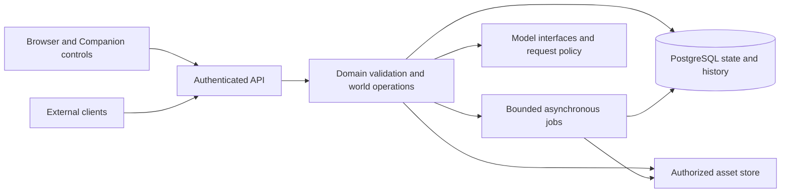

# Architecture overview

Exulanica uses a modular Python backend, PostgreSQL, retained content-addressed assets and a
TypeScript browser application. Models and simulation contribute through explicit boundaries;
rendered appearance is a representation of world state. This overview owns system shape and code
entry points. [Product direction](product-direction.md) owns scope; specialist contracts own
operation details.

## 1. System shape

A modular monolith keeps request handling and domain validation within one application. Expensive
perception, reconstruction and asset work use asynchronous jobs with retained outputs. The
[application](../exulanica/api/app.py) assembles routes and lifecycle hooks;
[Services](../exulanica/api/services.py) supplies database, store, model and worker configuration.
This separation supports independent execution of workers without requiring a service per feature.

The Companion is an AI partner exposed through world interaction tools. Its model outputs are
proposals or supported answers, not direct authority over database writes, identity or permissions.
Synthetic society has its own canonical state and events. These responsibilities share world
identities without treating observations, creations and simulations as the same kind of fact.

### 1.1 Front-end module boundaries

| Module | Responsibility |
| --- | --- |
| `atlas-core` | World presentation, spatial frames, selection and representation state |
| `atlas-react` | Browser rendering and interaction bindings |
| `companion-runtime` | Conversation and proposal flow without renderer dependencies |
| `world-index` | Indexed-world and entity inspection interface |
| `graph-client` | Client-side API access and mutation contracts |

The browser renderer is PlayCanvas. [Dependency rules](../web/.dependency-cruiser.cjs) and package
TypeScript configurations enforce module and ambient-global boundaries. Do not reconstruct those
rules from this summary; the checker owns the exact forbidden imports. The
[frontend integration contract](atlas-frontend-integration.md) owns review and mutation authority.

### 1.2 Replaceable interfaces

Model roles and providers, reconstruction stages, character assets and renderer representations
have distinct interfaces. A replacement must preserve declared inputs, outputs, permissions,
provenance and replay semantics. See [model selection](model-and-service-selection.md),
[reconstruction operations](scene-reconstruction-operations.md),
[characters](character-representation-contract.md) and [inspection](atlas-reconstruction-inspection.md).
Add an abstraction for a demonstrated replacement or responsibility, not hypothetical flexibility.

## 2. Platform split and deployment topology

The browser handles presentation and input. The backend validates operations, protects sources and
performs hosted model requests. Configured workers perform asynchronous work. The implementation
uses a local asset store; hosted inference does not imply that the API, database or workers run on
the same provider.

[Deployment](deployment.md) owns configuration, account sessions and service prerequisites.
[Worker operations](derivative-worker-operations.md) owns progress, shutdown and recovery. Provider
recommendations or configuration files are not evidence of an operating deployment.

### 2.1 PostgreSQL deployment tradeoffs

PostgreSQL is the consistency boundary for world state, evidence, permissions and changes. Separate
database roles constrain operations, including read-only Selection and isolated account access.
Deployment choices must preserve those boundaries, transactions, backup and recovery. Service size,
region and topology require workload and host evidence; old pricing estimates are not sizing rules.

## 3. Storage

The [domain and evidence model](domain-and-evidence-model.md) owns evidence addresses, schema and
identity assertions. [World objects](world-objects-contract.md) owns authored edits and version
concurrency. [Society](synthetic-society-contract.md) owns simulation state and replay. The renderer
consumes derived representations and cannot create canonical simulation events.

The [store interface](../exulanica/store/base.py) and [local implementation](../exulanica/store/local.py)
retain content-addressed bytes. Database references and asset lineage carry authority; a digest
alone does not authorize access. [Asset-read currency](asset-read-currency.md) owns checks at the
serving boundary. Source withdrawal affects dependent reads and artifacts under their contracts.

## 4. Object storage reality

Shared object storage and production streaming require explicit implementation and acceptance.
Personal world assets require authorized delivery; public showcase artifacts require a separate
publication decision. Content addressing is an integrity mechanism, not a claim of immutable
storage, permanent access or end-to-end encryption. [Privacy and deletion](privacy-consent-threat-model.md)
own those guarantees and limitations.

## 5. Query and answer safety

The [Companion question contract](companion-question.md) owns Selection, bounded evidence,
conversation persistence and appearance proposals. The model receives permitted context; validation
and authorization remain deterministic. Generated content cannot become observed evidence merely
because an answer cites it. A model's claimed confidence cannot substitute for supporting sources.

[Security](security-floor.md) owns the route permission and egress rules. The
[API surface](../exulanica/api/surface.py) and checked route/schema snapshots define the concrete
client boundary. External clients use the same authorized world operations as the application.

## 6. Prompt injection posture

Source text and generated proposals are untrusted data. Hosted requests pass through the configured
workspace policy before transport; see [hosted request policy](../exulanica/epistemics/hosted_requests.py).
A model cannot authorize itself, confirm a real person's identity or bypass a source right.
[Personal admission](personal-admission.md) and [person presentation](person-presentation-consent.md)
define those separate rights. Exact output validation belongs to the operation receiving it.

## 7. Runtime and model changes

The [model manifest](../exulanica/models/models.manifest.json) names configured roles and fallbacks.
Actual callers and [selection evidence](model-and-service-selection.md#0-implemented-stack-and-selection-decision)
establish which roles execute. Model-dependent operations report missing configuration; the presence
of a model identifier does not prove an integration or task-quality benefit.

Reuse retained expensive outputs within their version and permission boundaries. Simulation replay
uses recorded accepted decisions rather than repeating inference. Provider failures, stale inputs
and interrupted jobs remain distinct states with recovery defined by the owning contract.

## 8. Extension boundaries

Use [world composition](world-composition-contract.md) for importing or generating content,
[world model architecture](world-memory-model.md) for identity and representation semantics,
[simulation tooling](product-direction.md#modular-simulation-and-scientific-tooling) for candidate
solver adapters, and [World Memory Package](world-memory-package.md) for portable projections.
An exported asset does not automatically transfer behavior, private history or source rights.

## 9. Evidence and historical rationale

[Development setup](development-setup.md) describes verification commands. Operation contracts link
their evidence and gaps. Unit checks, visual acceptance, external-consumer acceptance and deployed
behavior answer different questions; none substitutes for the others.

The [fixed architecture research revision](https://github.com/twinkling-reality/exulanica/blob/857cffe730dad97f9edb34535c773115277e2769/docs/architecture-overview.md)
retains earlier hosting comparisons, measurements and rejected alternatives. Its proposed topology,
provider prices and delivery window do not define the running application. Changes belong in the
owning living contract and source, not as another correction appended to that research.
