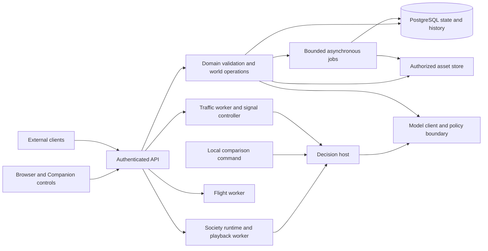

# Architecture overview

Exulanica is a modular Python backend on PostgreSQL, with retained content-addressed assets and a
TypeScript browser application. A world's people run on deterministic engines, open models make
their choices through one validated decision path, every hosted model call passes one policy
boundary, and rendered appearance is a representation of world state. This overview owns system
shape and source-code entry points. [Product direction](product-direction.md) owns scope;
specialist contracts own operation details.

## Contents

1. [System shape](#1-system-shape), with the [front-end modules](#11-front-end-module-boundaries),
   [backend layers](#13-backend-layers) and [people, models and movement](#14-people-models-and-movement)
2. [Platform split and deployment topology](#2-platform-split-and-deployment-topology)
3. [Storage](#3-storage)
4. [Object storage reality](#4-object-storage-reality)
5. [Query and answer safety](#5-query-and-answer-safety)
6. [Prompt injection posture](#6-prompt-injection-posture)
7. [Models, providers and the policy boundary](#7-models-providers-and-the-policy-boundary)
8. [Extension boundaries](#8-extension-boundaries)
9. [Evidence and historical rationale](#9-evidence-and-historical-rationale)
10. [Performance and language evaluation](#10-performance-and-language-evaluation)

## 1. System shape

A modular monolith keeps request handling and domain validation within one application. Expensive
perception, reconstruction and asset work use asynchronous jobs with retained outputs; a society's
playback, a world's bird flight and a town's traffic run in workers of their own, and a controller
thread prepares the traffic minutes whose signals a model was chosen for. The
[application](../exulanica/api/app.py) assembles routes and lifecycle hooks;
[Services](../exulanica/api/services.py) supplies database, store, model and worker configuration.
This separation supports independent execution of workers without requiring a service per feature.

```mermaid
flowchart LR
    UI[Browser and Companion controls] --> API[Authenticated API]
    Client[External clients] --> API
    API --> Domain[Domain validation and world operations]
    Domain --> DB[(PostgreSQL state and history)]
    Domain --> Assets[Authorized asset store]
    Domain --> Jobs[Bounded asynchronous jobs]
    Jobs --> Assets
    Jobs --> DB
    API --> Society[Society runtime and playback worker]
    Society --> Host[Decision host]
    Compare[Local comparison command] --> Host
    Host --> Models[Model client and policy boundary]
    Domain --> Models
    API --> Flight[Flight worker]
    API --> Traffic[Traffic worker and signal controller]
    Traffic --> Host
```

The Companion is an AI partner exposed through world interaction tools. Its model outputs are
proposals or supported answers, not direct authority over database writes, identity or permissions.
A society has its own canonical state and events, and a model that decides for one of its people
proposes an action the engine validates. These responsibilities share world identities without
treating observations, creations and simulations as the same kind of fact.

### 1.1 Front-end module boundaries

| Module | Responsibility |
| --- | --- |
| `app` | The application: `src/main.ts` composes the session, scene, panels and API clients; `src/ui` draws panels and may import neither `src/composition` nor the renderer |
| `atlas-core` | Scene graph, region frames, focus, view manifests and layout, with no React and no renderer |
| `atlas-react` | Renderer bindings, the anchor overlay, the HUD and comfort settings, with no graph mutations |
| `graph-client` | Entity graph reads, the assertion log, evidence resolution and, behind a second entry point, mutations; it sits under the other product packages |
| `world-index` | The index, entity detail and the provenance panel, with no renderer |
| `companion-runtime` | Turn generation, options, proposal drafting and escapes, with no view layer |
| `presentation` | Shared tokens, the world-style registry and the Companion's appearance |
| `formation` | Pipeline stage events and the reducer that turns them into what the page shows |
| `landing` | The public title, Purpose, Capabilities, Research and Waitlist pages, with no application state |
| `companion-forms` | A private development surface comparing forms of the Companion |
| `loom-tess` | One tessellator, built for the server's tile bake and for an edit-time preview |
| `loom-texture` | Offline, seeded texture sets |
| `loom-lettering` | Shop-sign lettering as data: the glyph catalog reader and the layout rule |
| `loom-gate` | Visual-gate vocabulary, thresholds and decisions for a browser run |
| `scene-synth` | Offline synthetic point maps for renderer comparisons, imported by nothing that ships |

The browser renderer is PlayCanvas. [Dependency rules](../web/.dependency-cruiser.cjs) and package
TypeScript configurations enforce module and ambient-global boundaries. Do not reconstruct those
rules from this summary; the checker owns the exact forbidden imports. The
[frontend integration boundary](atlas-world-customization-contract.md#7-frontend-integration-boundary)
owns review and mutation authority.

### 1.2 Replaceable interfaces

Model roles and providers, reconstruction stages, character assets and renderer representations
have distinct interfaces. A replacement must preserve declared inputs, outputs, permissions,
provenance and replay semantics. See [model selection](model-and-service-selection.md),
[reconstruction operations](scene-reconstruction-operations.md),
[characters](character-representation-contract.md) and [inspection](atlas-reconstruction-inspection.md).
Add an abstraction for a demonstrated replacement or responsibility, not hypothetical flexibility.

### 1.3 Backend layers

The backend's layering is a rule the tooling keeps. `[tool.importlinter]` in
[`pyproject.toml`](../pyproject.toml) declares an exhaustive layers contract, so a top-level package
nobody placed breaks `uv run lint-imports`. The HTTP surface (`exulanica.api`) depends on the domain
and nothing the product runs depends on it; above it sit only the evaluation harness, package
projection and orchestration. The world and its societies sit above movement and things, the model
client, the database and the store; traffic, reconstruction, the generator grammar and materials sit
lower still. Forbidden contracts beside the layers keep the model client, reconstruction, capture,
traffic, movement, things, materials, lettering and the generator system from importing what they
must not.
The contract in `pyproject.toml` owns the exact order.

### 1.4 People, models and movement

| Responsibility | Entry points |
| --- | --- |
| Society engines, chosen by what each can do | `exulanica/world/society_engines.py`, reading the engine table [`society-engines.v2.json`](../exulanica/world/society-engines.v2.json); the purposeful planner `exulanica/world/society_planner.py` |
| The ground a society stands on | [`society-ground.v2.json`](../assets/catalogs/society-ground/society-ground.v2.json), read by `exulanica/world/society_grounds.py` |
| Composing and serving a society | `exulanica/api/society_runtime.py` and the routes in `exulanica/api/routes/society.py` |
| Playback | `exulanica/api/society_control_worker.py` |
| Decision roles | The registry [`decision-roles.v3.json`](../assets/catalogs/roles/decision-roles.v3.json), `exulanica/world/decision_roles.py`, one adapter per role in `exulanica/world/roles/`, the one path in `exulanica/world/role_decisions.py`, the decider descriptor `exulanica/world/deciders.py`, an outside program's port `exulanica/api/external_asking.py`, the decision tables of migrations `0117_a_decision_role_s_documents_are_admitted_by_their_shape.sql` and `0122_a_model_may_decide_a_town_s_signal.sql`, and each role's host in `exulanica/api/role_hosts.py`, served by `exulanica/api/routes/world_models.py` |
| Asking the chosen models | `exulanica/api/decision_host.py` and `exulanica/api/society_person_decisions.py` for people; `exulanica/api/traffic_signal_controller.py` for signals |
| Comparisons of models | The loop `exulanica/world/society_comparison.py`, the runner `exulanica/api/society_comparison_runner.py`, the one definition path `exulanica/api/society_comparison_start.py`, each verified run's stored drawing `exulanica/world/society_comparison_drawing.py` (migration 0121), the start's claim and lease `exulanica/world/society_comparison_start_repository.py` played by `exulanica/api/society_comparison_worker.py`, the command `exulanica/orchestration/compare.py` and the Compare view `web/packages/app/src/ui/society-comparison.ts` with its start controls `society-comparison-start.ts` |
| Movement | The registry `exulanica/movement/registry.py`, reading [`movement-modules.v1.json`](../exulanica/movement/movement-modules.v1.json), with `walking.py` and `flight.py` beside it |
| Things | `exulanica/things`: thing kinds (`kinds.py`) read against the catalogs in [`assets/catalogs/things`](../assets/catalogs/things), looks, the origin record and translation manifests; the kinds and looks this repository ships are written by `scripts/things/shipped_things.py` |
| Flight serving | `exulanica/world/flight_worker.py`, binding the episode worker `exulanica/world/episode_worker.py`: one worker process computes flight episodes on a clock every viewer shares |
| Road traffic | `exulanica/traffic`, a pure deterministic simulation; `exulanica/world/traffic_host.py` serves a saved town's own roads (`saved_world_roads`, `GET /world/versions/{version_id}/traffic`) and a baked city's traffic (`GET /tiles/traffic`) for the development preview, with signal minutes sealed by `exulanica/api/traffic_signal_controller.py` |

A society's engine is chosen by what the engine table says it can do, never by a list in code.
A decision role is registry data plus one adapter module, so requests, receipts, their checks, the
host's asking and replay are one path for every role; two roles are registered, a person and a
junction signal. A
chosen model proposes, the engine validates, and replay reads stored receipts without a call. The
[society contract](synthetic-society-contract.md), the [decision roles contract](decision-roles-contract.md),
the [movement modules contract](movement-modules-contract.md), the
[things contract](things-contract.md) and [society experiments](society-experiments.md) own the
rules; the
[people and models guide](capabilities/simulation.md) explains them for a reader.

## 2. Platform split and deployment topology

The browser handles presentation and input. The backend validates operations, protects sources and
performs hosted model requests. Configured workers perform asynchronous work. The implementation
uses a local asset store; hosted inference does not imply that the API, database or workers run on
the same provider.

[Deployment](deployment.md) owns configuration, account sessions and service prerequisites.
[Worker operations](derivative-worker-operations.md) owns progress, shutdown and recovery. Provider
recommendations or configuration files are not evidence of an operating deployment.

### 2.1 PostgreSQL deployment tradeoffs

PostgreSQL is the consistency boundary for world state, evidence, permissions and changes. Separate
database roles constrain operations, including read-only Selection and isolated account access.
Deployment choices must preserve those boundaries, transactions, backup and recovery. Service size,
region and topology require workload and host evidence; old pricing estimates are not sizing rules.
A personal install keeps its database with `exulanica-local-db` ([local database](local-database.md)).

## 3. Storage

The [domain and evidence model](domain-and-evidence-model.md) owns evidence addresses, schema and
identity assertions. [World objects](world-objects-contract.md) owns authored edits and version
concurrency. [Society](synthetic-society-contract.md) owns simulation state and replay. The renderer
consumes derived representations and cannot create canonical simulation events.

The [store interface](../exulanica/store/base.py) and [local implementation](../exulanica/store/local.py)
retain content-addressed bytes. Database references and asset lineage carry authority; a digest
alone does not authorize access. [Asset-read currency](asset-read-currency.md) owns checks at the
serving boundary. Source withdrawal affects dependent reads and artifacts under their contracts.

## 4. Object storage reality

Content is stored in local directories or in an S3-compatible bucket that separate hosts share, with
the same keys and a separately privileged purge ([deployment](deployment.md#4-the-content-store)).
Acceptance on a production provider, and production streaming, require their own evidence.
Personal world assets require authorized delivery; public showcase artifacts require a separate
publication decision. Content addressing is an integrity mechanism, not a claim of immutable
storage, permanent access or end-to-end encryption. [Privacy and deletion](privacy-consent-threat-model.md)
own those guarantees and limitations.

## 5. Query and answer safety

The [Companion question contract](companion-question.md) owns Selection, bounded evidence,
conversation persistence and appearance proposals. The model receives permitted context; validation
and authorization remain deterministic. Generated content cannot become observed evidence merely
because an answer cites it. A model's claimed confidence cannot substitute for supporting sources.
An answer about a world's people cites the simulation and is marked as simulation, never memory.

[Security](security-floor.md) owns the route permission and egress rules. The
[API surface](../exulanica/api/surface.py) and checked route/schema snapshots define the concrete
client boundary. External clients use the same authorized world operations as the application.

## 6. Prompt injection posture

Source text and generated proposals are untrusted data. Every hosted request passes the policies
attached to the one model client before transport, and the workspace's request policy decides what
it may carry ([hosted request policy](../exulanica/epistemics/hosted_requests.py)). A model cannot
authorize itself, confirm a real person's identity or bypass a source right.
[Personal admission](personal-admission.md) and [person presentation](person-presentation-consent.md)
define those separate rights. Exact output validation belongs to the operation receiving it.

## 7. Models, providers and the policy boundary

Every hosted model call is made by `ModelClient` ([`exulanica/models/client.py`](../exulanica/models/client.py)),
which hands each request to its attached policies before anything else; a client with no policy
refuses to send (`exulanica/models/policy.py`). The egress allowlist (`exulanica/models/egress.py`)
limits the origins its transport may reach, and the budget guard (`exulanica/models/budget.py`)
stops a runaway loop. The workspace's request policy withholds a person's name from every request,
a place's name without a right that releases it, and a photograph without a current personal model
right.

Providers and models are data in the [model manifest](../exulanica/models/models.manifest.json):
each provider's base address, credential variable and catalog, each model's catalog facts, the
roles and fallbacks the product's own callers use, and, for a model a world may choose, the recorded
probe of how it answers a choice. The decision role registry states which use cases a model must
declare to be offered each role. Actual callers and
[selection evidence](model-and-service-selection.md#0-implemented-stack-and-selection-decision)
establish which roles execute. Model-dependent operations report missing configuration; the presence
of a model identifier does not prove an integration or task-quality benefit.

Reuse retained expensive outputs within their version and permission boundaries. Simulation replay
uses recorded accepted decisions rather than repeating inference. Provider failures, stale inputs
and interrupted jobs remain distinct states with recovery defined by the owning contract.

## 8. Extension boundaries

Use [world composition](world-composition-contract.md) for importing or generating content,
[world state architecture](world-memory-model.md) for identity and representation semantics,
[simulation tooling](product-direction.md#modular-simulation-and-scientific-tooling) for candidate
solver adapters, and [World Memory Package](world-memory-package.md) for portable projections.
An exported asset does not automatically transfer behavior, private history or source rights.

## 9. Evidence and historical rationale

[Development setup](development-setup.md) describes verification commands. Operation contracts link
their evidence and gaps. Unit checks, visual acceptance, external-consumer acceptance and deployed
behavior answer different questions; none substitutes for the others.

The [fixed architecture research revision](https://github.com/twinkling-reality/exulanica/blob/857cffe730dad97f9edb34535c773115277e2769/docs/architecture-overview.md)
retains earlier hosting comparisons, measurements and rejected alternatives. Its proposed topology,
provider prices and delivery window do not define the running application. Changes belong in the
owning living contract and source, not as another correction appended to that research.

## 10. Performance and language evaluation

Python, TypeScript and SQL remain the application foundation, with GLSL/WGSL for supported rendering
work and compiled libraries behind existing interfaces. Language adoption is a measured engineering
decision, not a feature milestone. This evaluation does not select a Rust component, custom CUDA
kernel or application rewrite.

### Representative-world performance baseline

Establish a reproducible performance baseline after a connected saved-world interaction works and
before expanding its supported scale. Use a permitted representative world plus deterministic
scale fixtures with increasing visible objects, point counts, asset sizes and active population.
Declare those dimensions, hardware, browser/runtime versions, quality settings, cold/warm cache
conditions and target budgets before comparing implementations. Synthetic fixtures establish
measured capacity for their workload, not general personal-world coverage.

| Workload | Measurements and correctness checks |
| --- | --- |
| Open and revisit a saved world | Time to usable interaction, bytes transferred, decode/upload time, peak CPU/GPU memory and reuse of unchanged assets |
| Inspect and edit moving objects | Frame-time distribution and stalls, selection/edit latency, draw calls, point preparation, stable identities and normal/point transform agreement |
| Run and inspect a bounded scenario | Queue/preparation/step time, CPU/GPU utilization, result size, cancellation/recovery and the declared replay or numerical-repeatability guarantee |
| Read or export a bounded projection | Query/validation/serialization time, transfer size, peak memory, exact identity/digest preservation and rejection of malformed input |

Attribute time to algorithms, data copies, allocations, database access, network transfer and
GPU work separately. Compare batching, caching, indexing and established compiled libraries
before proposing a language change. Measure both the limiting operation and the complete user
workflow; a faster kernel with expensive transfer or startup may leave the experience slower.

### Implementation choices

| Option | Scope and condition |
| --- | --- |
| GLSL/WGSL | Extend existing browser GPU work when rendering or compatible point/geometry processing is the measured limit. Verify supported browser paths, precision, resource release and visual correctness. |
| Warp through Python | Evaluate compiled numerical work in the bounded physics project of the [simulation tooling program](product-direction.md#modular-simulation-and-scientific-tooling). Include preparation, compilation and CPU/GPU transfer costs in the comparison. |
| Rust, optionally WebAssembly | Evaluate an isolated CPU-intensive or memory-sensitive component such as asset decoding, geometry preparation or portable validation when existing implementations miss declared budgets. Native and browser execution require separate measurements. |
| Custom C++/CUDA | Use for a required native integration or a demonstrated gap that maintained libraries cannot meet. Specify the supported hardware and ongoing build/debug/dependency burden before adoption. |

Promote an implementation only when it improves the declared workflow target while preserving
quality, permissions, identity, failure behavior and resource bounds. Retain the baseline and
comparison artifacts, portability results and maintenance rationale. Cross-language boundaries
declare schemas, ownership, numeric precision and error semantics; canonical hashes and exact
integer contracts must survive conversion without loss. Numerical simulation tolerances do not
weaken exact storage or identity contracts. Keep replacements behind existing module, worker or
artifact interfaces; a language change alone does not justify another service or world store.
