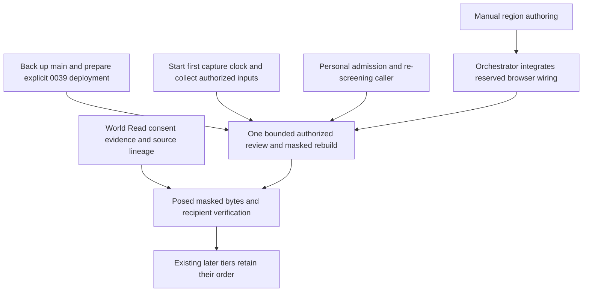

# Audit of the remaining-work estimate

Read against main at `1353a21`, 2026-09-08. This is a read-only code audit and a set of proposed
briefs, not a replacement roadmap. No feature implementation or new real-data run was performed.
The earlier independent integration gates and their limits are in `integration-2026-09-08.md`.

## Corrections

1. **The total cannot be reconciled to its inventory.** The document calls 42.5 packages a floor.
   Its seven sized tiers sum to 28.6: 3.8 + 3.2 + 3.5 + 4.5 + 4.6 + 5 + 4. The remaining 13.9
   packages have no item-level allocation. Operations and recovery are explicitly unsized, so
   they cannot explain that difference without another ledger. Summing the rows would have caught
   this. The estimate may still be low, but neither 42.5 nor a revised larger number is auditable
   from this file. An adversarial pass instructed to increase estimates does not establish a
   mathematical lower bound. Commit count supplies no measured conversion to working days.
   Keep corpus, decisions and calendar as known blockers; withdraw the stronger conclusion that
   engineering is not binding until a critical path and measured throughput support it.

2. **Tier 1 obscures existing production primitives.** Personal authority already exists in
   `exulanica/ingest/privacy.py:232`. Detection-only and human screening writers already exist at
   lines 480 and 386. Human screening has a production caller at
   `exulanica/ingest/reference_admission.py:106`. What is missing is an operator-facing personal
   admission and re-screening workflow: the exposed reconstruction-admission route only accepts
   reviewed benchmarks, and the personal authority and detection writer have no production
   callers in `exulanica/` or `scripts/`. Definition searches followed by caller searches catch
   the distinction. The 1.5 admission package and 1.0 writer package need distinct acceptance
   boundaries before anyone adds them together. Do not build duplicate authority tables or
   screening writers. This is substantial wiring work, not proof of a 2.5-package saving.

3. **A local segmenter is not a prerequisite to all personal intake or review.** The manual
   backend already supports `add` with an outline in
   `exulanica/api/routes/person_consent.py:43`. The browser API only types confirm/delete in
   `web/packages/app/src/person-review-api.ts:153`, and the panel exposes no add callback in
   `web/packages/app/src/ui/person-review.ts:52`. Reading the action schema and following it to
   the mounted callbacks catches the gap. Manual review can locate a person without an external
   detector. This does not establish detector recall or authorize hosted vision. Swap the Tier 2
   manual-add item with the Tier 1 segmenter-selection item for the first bounded review run.

4. **The mandatory retraining cascade is overstated.** The document says the first person region
   invalidates the mask key, forces a bowl retrain, and requires re-recording every record naming
   those scenes. `capture_mask_is_current` in `exulanica/ingest/masked_inputs.py:150` is a predicate;
   it returns true when no person needs masking. Changed mask inputs can require a new derivative
   and invalidate eligibility, but this function neither schedules training nor rewrites records.
   More decisively, `exulanica/ingest/scene_selection.py:111` refuses masked splat selection until
   source/held-out hash remapping exists. Pose/placement and honest refusal remain alternatives.
   Trace callers, state transitions and job selection, not just the predicate's prose. Historical
   digest-bound records remain dated observations; publish successors for new claims instead of
   treating every past record as mutable debt. The eventual affected-lineage rebuild is real work.

5. **The identity-policy correction goes further than its evidence.** The proposer really allows
   person candidates and writes `auto_provisional` links; absence of biometrics and absence of
   confirmed links do not make that stop being automatic proposal/link creation. The roadmap at
   `docs/frontier-roadmap.md:672` expressly excludes people from automatic linking. A module's
   docstring explains implementation intent, not which policy interpretation the operator chose.
   The document itself then calls this an unenforced safety constraint in Tier 1. Compare the
   policy sentence, candidate filter and persisted state, and record whether contextual provisional
   person links are permitted. Do not assert either a confirmed safety defect or a resolved benign
   ambiguity before that decision.

6. **The supposedly exhaustive inventory omits entity-addressed World Read.**
   `exulanica/graph/world_read.py:397` explicitly says a person/object ID cannot address a bundle.
   Object-link precision in Tier 7 does not implement that read path. Search the declared
   `not_addressable` limitations and reconcile them to deliverables. Add an unsized line to the
   inventory pending a brief; do not invent another package estimate.

7. **Tier 5 cannot all run alongside everything.** A `mount()` extraction and manual review or
   place-browser wiring meet in `main.ts`. Wire parity/exhaustiveness work meets place-field
   changes in the graph contracts. These are ownership dependencies even when merges are clean.
   Compare file sets before starting tasks. Keep the tier; remove the unconditional concurrency
   claim. Full verification runs also need to share this 18 GB machine sensibly.

## Tier 3 holds up, but must stay separate from training export

`world_read.py:148` gives a posed view a camera and capture ID, not a photo-byte reference.
`world_read.py:188` gives geometry output artifact digests, not its source-derivative chain.
`read_consent.py:323` still returns `internal_only`; its two explicitly unearned release states
correspond to the missing person evidence and source lineage. Its clock concern is real: copying
a live consent predicate into recorded digest inputs is not a solution.

The landed training profile is `exulanica-wmp-training-1.1`, a different contract. Its receipts and
verifier are useful precedents, not evidence that World Read now supplies those fields. Tier 3's
three deliverables remain open. A recipient-checkable receipt proves recorded facts at a stated
time; it cannot tell an offline recipient about a later withdrawal. No brief should silently
raise release permissions while adding evidence fields.

## Reconciliation with the three former in-flight branches

All three are ancestors of current main. Their implementation tasks are idle at this audit.

| Branch | Landed tip | What can shrink | What remains |
| --- | --- | --- | --- |
| phase-7b-training-consent | 23ed18f | Any separately counted training-export permission/verification implementation | Tier 3 World Read; Tier 7 subject-facing consent; real licensee evidence |
| frontier-run-and-read-bounds | f10a014 | Preflight/rehearsal preparation; C supplied the 0038 deployment/re-record evidence used in Tier 5 reconciliation | Tier 1 personal admission caller; Tier 5 materialized graph; Tier 6 configured models, personal corpus, scene/receipt gaps |
| gpu-and-real-geometry | fb15c34 | Reconstruction queue dispatch implementation and retrospective-measurement setup if counted elsewhere | Tier 2 masked training; Tier 4 place-alignment queue; Tier 6 actual personal splat attempt; registry/real dispatch evidence |

The explicit instruction was already to exclude this work from the estimate. Therefore landing
these branches does not justify subtracting their whole effort again. The certain named deletion
from today's list is Tier 5's 0.5-package ticket reconciliation, completed in `1353a21`. This
leaves 28.1 in the listed rows as arithmetic only, not a new estimate of project effort.

C's bounded page response does not make server grouping a range scan, and its browser still
requests the whole graph. A's scene worker does not implement a place-alignment worker. Its real
bowl measurement had zero person regions, so zero intersections establish no masking recall.
B's owner attestations do not implement photographed-person authentication.

One missed deployment handoff matters before a live run: code includes migration 0039, retained
public was last independently observed at 0038, and frontier preflight actually refused that
state. Applying 0039 is an explicit deployment action after backup, not a new schema-design task
and not something a rehearsal or admission command should do implicitly.

## Next work, without a wholesale resequence

First back up/push main: at audit time it was clean and 35 commits ahead of origin/main. Do not
confuse a Git push with a tested database/artifact recovery plan. Start the weeks-apart capture
clock and supply authorized inputs/signing material in parallel, keeping private material out of
Git. Record the person-proposal policy decision before exercising that path on personal data.

Start the admission workflow and manual-add review briefs below. Queue the World Read evidence
brief until one slot clears. There are no currently active implementation tasks among the three
previous owners, but two simultaneous implementations and serialized full suites are the
comfortable machine budget. The one proposed tier swap is manual add versus segmenter selection.
World Read evidence can be developed on labelled fixtures without waiting for every Tier 2 real
run; that is parallel preparation, not release permission. Keep the generated-seam disclosure
brief from the integration report queued behind this immediate admission/review work.

Copy-ready implementation briefs, to be started by the operator:

- `briefs/2026-09-08-personal-admission.md`
- `briefs/2026-09-08-manual-person-review.md`
- `briefs/2026-09-08-world-read-evidence.md`

These are bounded proposals. No new task, worktree, migration, push or paid run was started by
this audit. The original sizing document is preserved for review.

## Subsequent implementation checks

The operator subsequently started the admission and manual-review briefs. Their executed checks
found a more important gap than the initial read-only audit established: after a region changes,
the SQL admission predicate can still accept an old eligible screening while the current mask is
missing. The personal-admission record distinguishes that known failing baseline from the killed
mutant for the new command's local currency guard. This proves stale admission acceptance, not
stale geometry production or disclosure. Frontier and scene-admission direct SQL callers remain
outside that local fix. The original audit's rejection of a mandatory retraining cascade still
holds; it must not be read as verification that every downstream consumer already refuses stale
inputs.

Manual review also required a narrow backend extension: a source withheld for a missing mask
discarded its capture ID, preventing a saved review from reopening after a full page reload.
Preserving that live identity in the authenticated metadata path, while retaining byte refusal,
closed the tested reload gap. Component tests alone had not found it.

One finding from this orchestrator was wrong and was corrected openly: I initially inferred that
the admission command's search path could borrow public migration history. Its imported
`exulanica/db/migrate.py:62` helper already qualifies the migration table with current_schema.
Reading that callee would have caught my mistake. The command-level regression now demonstrates
refusal against an empty schema ahead of a migrated isolated fallback, with no fallback writes.
No redundant guard was added.

The next proposed serialized brief is `briefs/2026-09-08-stale-screening-policy.md`, reserving
migration 0040 for dispatch only after both current integrations. It precedes personal-data
activation and the queued World Read work. It is a response to an executed failure, not a
wholesale replacement of the seven-tier sequence. No new package estimate is asserted.
