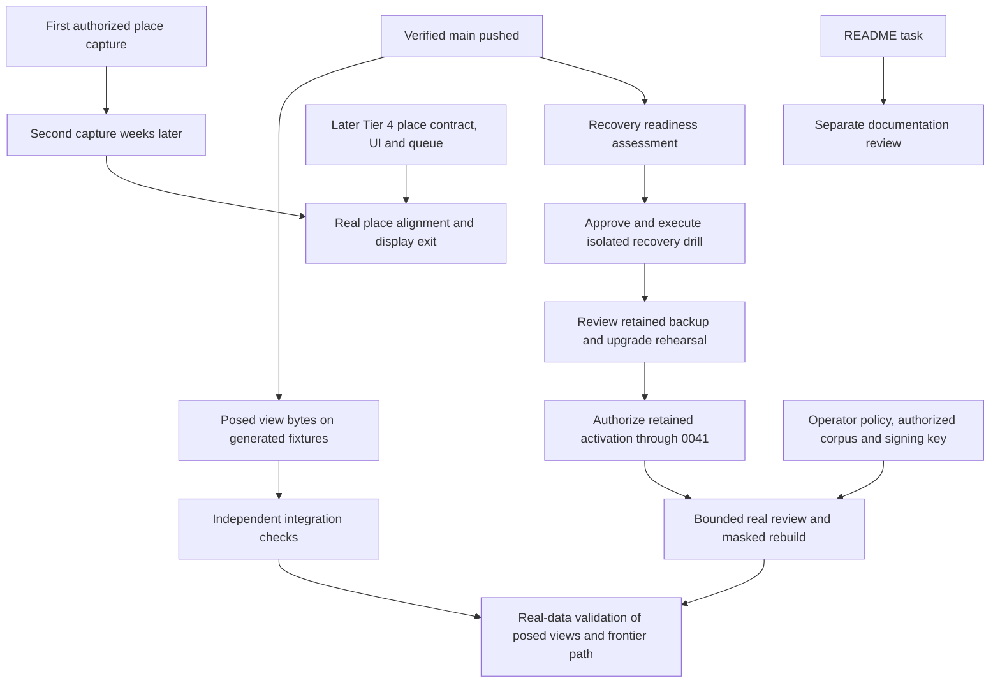

# Infrastructure backlog and historical dispatch

**Product priority update:** [product-direction.md](product-direction.md) now defines the creative-world
sequence. This page retains the infrastructure backlog and its dependencies; it does not schedule
the entire product or authorize dispatch.

## Current checkpoint, 2026-09-08

Main was pushed at `d6b89d8`. Posed-view byte delivery and the recovery readiness assessment
have landed; see [integration evidence](records/2026-09-08-integration-posed-views-recovery.md).
The approved documentation review has also landed. Do not dispatch those tasks again.
The isolated recovery drill remains unexecuted and retained activation is not established.

The next product priority is the usable-scene milestone in
[product direction](product-direction.md#immediate-scene-and-infrastructure-exit).
Inspect existing trained outputs before commissioning another run. This does not authorize
paid compute, retained-data changes, or a new implementation task without a scoped brief.
The original package count has not been re-estimated. Tier 3's fixture-backed posed-byte
handoff is complete; real-source validation remains. Recovery assessment completion does
not establish recoverability in deployment.

## Historical dispatch at 46e106b

The remainder records the earlier dispatch and its then-current findings. Its proposed tasks,
status table and diagram are historical, not the current start list.

Read against main 46e106b on 2026-09-08. Remote main was independently checked at that same tip
after the authorized push. This was a dispatch view, not a replacement for the historical
sizing document or the Phase 10 tickets. No revised package count or delivery date is asserted.

## What changed

The admission/manual-review implementation, shared screening and asset-read currency, World Read
consent evidence and geometry lineage, and prospective consent timestamp fix have landed.
The latest independent integration ran 2152 backend tests with 3 skips and 876 web tests, plus
lint, import, type and boundary gates. See integration-consent-timestamp-2026-09-08.md and its
predecessor integration reports. These are fixture/code results, not a retained personal-data run.
Those reports' statements that main is unpushed are dated history, superseded by this push.

## Start two bounded tasks

1. Recovery readiness assessment: briefs/2026-09-08-recovery-readiness.md. Documentation only;
   inventory the actual recovery boundaries and prepare the drill and activation briefs.
2. Posed view bytes: briefs/2026-09-08-posed-view-bytes.md. Complete Tier 3's remaining exact
   photo-byte handoff on generated fixtures, retaining current permission and digest semantics.

Both are proposed, not dispatched. No worktree, branch, new migration or suite reservation was
created by writing these briefs. The earlier queued backup assessment could not be found in the
current task list or worktree inventory; its execution cannot be assumed. The external README
task is ongoing by operator report and retains ownership of its worktree.

Arrows are dependencies, not estimates. Posed-view development does not wait for retained-data
activation. The existing manual path means a local segmenter is not a prerequisite for a bounded
manual pilot; neither manual tooling nor detector output proves person-finding recall. The first
authorized place capture can start the calendar independently of implementation work.

## Remaining queue, preserving the existing tiers

| Area | Current next boundary |
| --- | --- |
| Tier 0 | Git push done; authorized inputs, key custody and weeks-apart capture remain operator work |
| Tiers 1-2 | Admission and manual review code landed; decide contextual person-proposal policy, validate real review/rebuild, select a local segmenter if required, and separately solve masked Gaussian training |
| Tier 3 | Consent evidence and actual geometry lineage landed; posed view byte delivery remains |
| Tier 4 | Place browser contract then UI; place-alignment queue; two real captures joined and displayed |
| Tier 5 | Ticket reconciliation done; wire parity, adapter exhaustiveness, mount decomposition, graph materialization, thin routes and CI verification still require scoped review; not all can run concurrently |
| Tier 6 | Frontier clause/scene/receipt gaps and configured-model/personal-corpus execution require validation; a pushed commit is not proof that remote CI passed |
| Tier 7 | Blind object precision, real generative conditioning, subject-facing consent, measured place thresholds and actual resident-byte pressure remain |
| Outside original sizing | Deployment recovery and hosted operation; entity-addressed World Read remains an unsized gap |

Later rows are a queue, not implementation-ready briefs or a fresh exhaustive code audit. The
initial 42.5-package estimate remains unreconciled: see roadmap-audit-2026-09-08.md. Do not subtract
whole earlier branch efforts twice or treat the old 10-14 working-day conversion as measured.

## Checks behind this dispatch

- graph/world_read.py::_view still has camera and capture metadata but no photo-byte descriptor.
- api/routes/evidence.py::masked already selects and rechecks current permitted bytes. A new
  bundle reference must bind exact bytes and compatible calibration, not merely reuse its URL.
- deletion/restore.py already seals checkpoints and enforces replay; tests/test_restore_replay.py
  exercises a real dump/restore. Deployment-specific backups and independent checkpoint survival
  remain a separate proof. An assessment must not seal the retained source as a read-only probe.
- The last retained-public observation is schema 0038; existing migrations 0039-0041 need an
  explicit deployment handoff. No new migration is assigned to either proposed task.
- The proposed tasks have disjoint writable sets and do not own README.md or main.ts. Only the
  posed-view task needs the database suite initially. A later recovery drill must serialize with it.

Release remains internal_only. The public source repository does not change media permissions.
